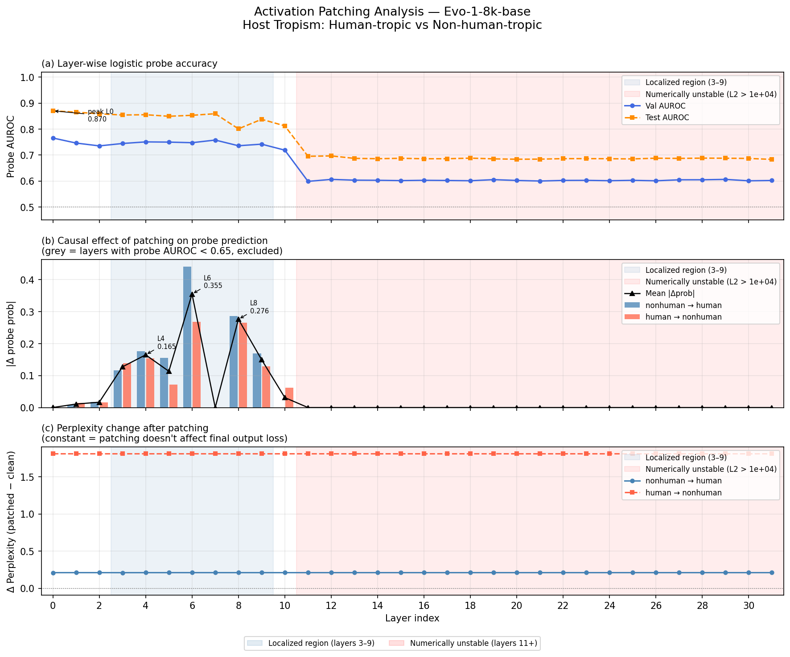
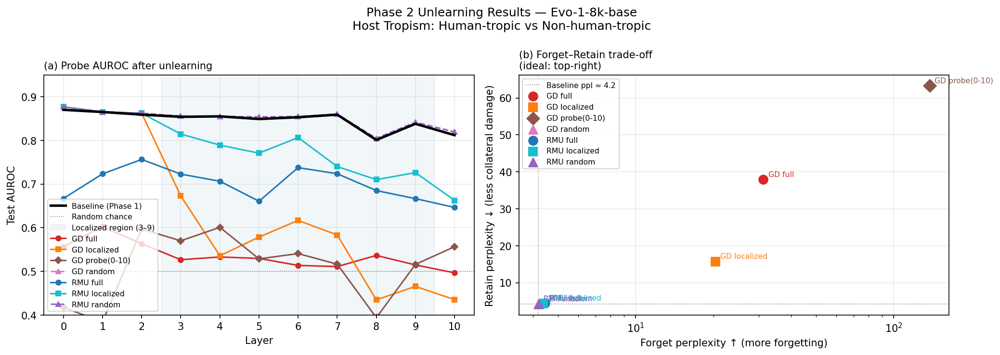
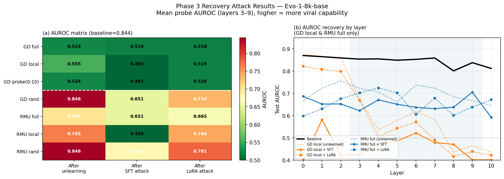

# Genomic Capability Localization and Unlearning in Evo-1

This repository studies whether a genomic capability in
[`Evo-1-8k-base`](https://huggingface.co/togethercomputer/evo-1-8k-base) can be:

1. localized to specific model layers with probes and activation patching;
2. selectively weakened with Gradient Difference (GD) or Representation
   Misdirection for Unlearning (RMU); and
3. tested for recovery under full-parameter and LoRA fine-tuning attacks.

The current experiments focus on viral host-tropism and Coronaviridae-related
representations. The code supports internal representation/perplexity
diagnostics and downstream LoRA evaluation on HVUE, GUE, Hiyata Host Tropism,
and optional viral-retain tasks.

> [!IMPORTANT]
> This repository contains two different unlearning objectives. The original
> experiments target **global human host tropism**; newer RefSeq experiments
> target **Coronaviridae family identity**. Only compare checkpoints whose
> `meta.json` files use the same `forget_csv`, `retain_csv`, and label semantics.
> A directory name containing `full` describes trainable layers, not the
> biological objective.

## Current status

| Area | Status |
|:---|:---|
| Phase 1 probing and activation patching | Complete |
| RefSeq Coronaviridae localization | Complete; selected layers `[5, 6, 7, 8, 9]`, primary layer 6 |
| GD/RMU condition sweeps | Complete for the checked-in Task 2 grid |
| Full-depth RMU layer scan | 17/17 runs complete |
| RMU layer 6/8 tuning | 24/24 baseline and tuning runs complete |
| HVUE/GUE LoRA evaluation of the earlier full-model grid | Complete for four selected candidates |
| RMU Pareto candidate LoRA evaluation | In progress; do not treat as a final result |
| Phase 3 recovery attacks | Implemented; current attack setting is preliminary |

Machine-readable progress and results are stored under `data/phase2/`, notably:

- `data/phase2/experiment_audit.json`
- `data/phase2/results/task2_runs.csv`
- `data/phase2/checkpoints_rmu_tuning/tuning_summary.csv`
- `data/phase2/full_benchmarks_lora_optimized_s600/full_rankings.csv`
- `data/phase2/checkpoints_rmu_pareto/progress.json`

## Main findings so far

### Research question

The central question is whether viral-sequence-related capabilities can be
durably removed from an open-weight genomic foundation model while:

1. producing a clear performance drop on target viral tasks (**Forget**);
2. preserving GUE and non-target viral performance (**Retain**); and
3. remaining difficult to recover through later fine-tuning (**Durability**).

The experiments so far show that GD and RMU can change target viral
capabilities, but they do not yet establish selective, durable, and
recovery-resistant removal.

### Localization



- The original host-tropism run found high probe AUROC in early layers and a
  broader causal region at layers 3–9.
- The RefSeq Coronaviridae rerun selected the current sparse localized set
  `[5, 6, 7, 8, 9]`, with layer 6 as the primary target.
- Layers 0–2 can be linearly decodable while having little patching effect:
  probe salience is not the same as intervention salience.
- Single-layer patching produces nearly flat language-model loss changes,
  suggesting downstream compensation.

### Unlearning



Internal probe AUROC and forget/retain perplexity are useful optimization
diagnostics, but they are not the primary selective-unlearning claim. Final
selection uses downstream benchmark deltas:

| Axis | Tasks | Desired direction |
|:---|:---|:---|
| Forget | HVUE host tropism, pathogenicity, and transmissibility | Score decreases relative to base Evo |
| Retain | GUE promoter, splice-site, TF-binding, and chromatin tasks | Minimal change relative to base Evo |
| Optional viral retain | ViroBench/vGUE-style non-overlapping taxon tasks | Minimal change relative to base Evo |

In the completed external evaluation of four earlier full-model candidates:

- `lora_gd_full_ar3_s200` produced the largest mean HVUE decrease, but also a
  substantial GUE decrease.
- `lora_rmu_full_sc50_s200` preserved GUE most closely, but produced almost no
  HVUE decrease.
- These results expose the current forgetting–retention trade-off; they do not
  establish a final winner.
- The newer RMU layer-6/layer-8 Pareto candidates still require completed
  downstream LoRA evaluation before comparison with the earlier grid.

See
`data/phase2/full_benchmarks_lora_optimized_s600/full_rankings.csv` for exact
paired scores and confidence intervals.

## Completed 44-task full benchmark

The earlier lightweight benchmark was used to screen candidates. The completed
full benchmark evaluates four selected checkpoints on a common set of 44
downstream tasks:

| Group | Tasks | Role |
|:---|---:|:---|
| HVUE forget | 5 | Measure target viral-task forgetting |
| GUE retain | 33 | Measure preservation of general genomic capability |
| ViroBench viral retain | 6 | Measure collateral damage to other viral capabilities |

Two Calici-related tasks were excluded from the final ranking because of their
high taxonomy-shortcut risk.

### Metrics

- **Forget drop:** `base - unlearned`; larger is stronger forgetting.
- **Retain delta:** `unlearned - base`; values near zero are preferred.
- **Balanced Forget:** equal-weight mean of the primary and secondary
  forget-task groups.
- **Selection Score:** `Balanced Forget - GUE penalty - viral-retain penalty`.

Selection Score is a screening heuristic, not a substitute for inspecting the
paired forget and retain deltas.

### Overall results

| Checkpoint | Setting | Balanced Forget | HVUE mean drop | GUE delta | Viral delta | Selection Score |
|:---|:---|---:|---:|---:|---:|---:|
| `lora_gd_full_ar3_s200` | Stronger GD | **0.207** | **0.198** | -0.144 | -0.0266 | **0.0357** |
| `lora_gd_full_ar5_s500` | Higher-retain, longer GD | 0.086 | 0.084 | -0.105 | -0.0218 | -0.0402 |
| `lora_rmu_full_sc50_s200` | Weaker RMU steering | 0.0045 | 0.0057 | **+0.0012** | -0.0066 | -0.0021 |
| `lora_rmu_full_sc200_s200` | Stronger RMU steering | 0.031 | 0.036 | -0.044 | -0.0058 | -0.0189 |

The four checkpoints expose two different failure modes:

- **GD can forget, but lacks selectivity.** `lora_gd_full_ar3_s200`
  produces the clearest external forgetting signal, but also causes the
  largest GUE decrease. Increasing the retain weight and training longer in
  `lora_gd_full_ar5_s500` weakens forgetting without reducing retain damage
  enough to improve the trade-off.
- **RMU can retain, but the earlier steering settings do not forget enough.**
  `lora_rmu_full_sc50_s200` preserves GUE almost exactly but produces almost
  no useful forgetting. Increasing the absolute steering norm in
  `lora_rmu_full_sc200_s200` increases forgetting only modestly while GUE
  also begins to fall.

The current conclusion is therefore not that one method has solved selective
unlearning. GD is the strongest-forgetting baseline, while the earlier RMU
settings motivate a more careful search over steering scale, loss layer, and
retain constraints.

## Next-stage RMU experiments

The new RMU design addresses four limitations exposed by the completed full
benchmark:

1. absolute target norms do not account for layer-specific activation scale;
2. layer 6 alone is insufficient to identify the best loss layer;
3. broad parameter updates may alter shared general representations; and
4. retain loss on random training batches does not establish held-out retain
   preservation.

The revised implementation therefore:

- calibrates the steering target to the reference activation RMS, so ratios
  such as `0.5`, `1.0`, and `1.5` have a comparable meaning across layers;
- explicitly separates the trainable parameter range from the RMU loss layer;
- creates an independent hook, steering direction, scale, and loss record for
  each loss layer; and
- evaluates held-out forget and retain representation MSE and
  original-modified cosine similarity.

Three representative configurations test complementary questions:

| Checkpoint | Core setting | Question |
|:---|:---|:---|
| `rmu_pareto_l8_ratio050` | Layer 8, ratio 0.5, retain weight 1, LR `5e-6` | Can conservative calibrated steering produce useful forgetting with low retain cost? |
| `rmu_pareto_l8_ratio150` | Layer 8, ratio 1.5, retain weight 1, LR `5e-6` | Does stronger layer-8 steering add more forgetting than retain damage? |
| `rmu_pareto_l6_ar2_lr1e5` | Layer 6, ratio 1.0, retain weight 2, LR `1e-5` | Can layer 6 with stronger retain protection provide a better balance? |

These configurations are intended to identify whether the main RMU bottleneck
is insufficient steering strength, loss-layer choice, retain protection, or an
overly broad update range. They should not be treated as final results until
their downstream evaluations are complete and validated.

### Recovery attacks



The implemented Phase 3 pipeline applies SFT and LoRA recovery attacks. In the
current preliminary setting, LoRA recovery is weak and SFT often degrades even
the control checkpoints. The present result should therefore be interpreted as
an underpowered attack configuration, not evidence of definitive robustness.

## Repository layout

```text
.
├── phase1/                         # dataset construction, probes, patching
│   ├── build_refseq_family_target_dataset.py
│   ├── extract_features.py
│   ├── train_probes.py
│   ├── activation_patching.py
│   ├── select_localized_layers.py
│   └── run.sh
├── phase2/                         # unlearning and downstream evaluation
│   ├── unlearn_gd.py
│   ├── unlearn_rmu.py
│   ├── eval_unlearn.py
│   ├── eval_benchmarks.py
│   ├── run_task2_sweeps.py
│   ├── run_benchmark_pilot.py
│   ├── prepare_benchmarks.py
│   ├── run.sh
│   └── sweep_configs/
├── phase3/                         # SFT/LoRA recovery attacks
│   ├── attack_sft.py
│   ├── attack_lora.py
│   └── run_attacks.sh
├── data/                           # manifests and checked-in lightweight results
├── figures/                        # report figures
├── docs/                           # environment and experiment notes
└── final_benchmark_plan.md         # detailed external-evaluation protocol
```

Model weights, raw sequence corpora, large activation matrices, and generated
checkpoints are intentionally excluded by `.gitignore`.

## Requirements

The experiments require:

- Linux with a CUDA-capable GPU;
- Python with PyTorch, Evo/StripedHyena, `safetensors`, NumPy, pandas,
  scikit-learn, matplotlib, and the Hugging Face data stack;
- a local Evo-1 model directory at `./evo-1-8k-base`; and
- the corresponding Evo inference configuration, typically
  `configs/evo-1-8k-base_inference.yml`.

The development workspace uses the `UT-p1` Conda environment:

```bash
conda activate UT-p1
python env_test.py
```

The repository does not currently include a portable environment lock file.
See `docs/project_environment.md` for the workspace-specific interpreter.
Several launcher scripts default to that interpreter but accept
`PHASE2_PYTHON` as an override:

```bash
export PHASE2_PYTHON="$(command -v python)"
```

## Data and checkpoint conventions

### Unlearning objectives

| Objective ID | Forget set | Retain set | Typical checkpoint roots |
|:---|:---|:---|:---|
| `global_host_tropism` | Human-tropic viruses | Non-human-tropic viruses | `checkpoints_lora_grid/`, earlier `checkpoints_tuned/` runs |
| `coronaviridae_family` | Coronaviridae | Non-Coronaviridae | `checkpoints_layer_scan/`, `checkpoints_rmu_tuning/`, `checkpoints_rmu_pareto/` |

The global host-tropism training split contains 3,800 forget and 3,814 retain
sequences. The balanced Coronaviridae split contains 1,888 windows per class.
The Coronaviridae positive set includes non-human coronaviruses, so it must not
be described as a human-host-tropism forget set.

Every new sweep should set `forget_csv` and `retain_csv` explicitly in its JSON
configuration. Before aggregating runs, inspect each checkpoint's `meta.json`.

### Checkpoint format

Unlearning checkpoints store `weights.safetensors` plus metadata and evaluation
artifacts in the run directory. Intermediate checkpoints can be requested with
`--save-steps`; large layer scans can delete temporary weights after internal
evaluation with `--delete-checkpoint-after-internal-eval`.

## Quick start

Run commands from the repository root.

### 1. Audit available data

```bash
bash phase2/run.sh audit
```

The audit records local manifests, raw benchmark coverage, and checkpoint
availability in `data/phase2/experiment_audit.json`.

### 2. Run Phase 1 localization

```bash
bash phase1/run.sh all
```

Phase 1 extracts all 32 layer representations, fits balanced logistic probes,
runs GC/k-mer baselines, performs activation patching, and selects causal
layers. Feature extraction is GPU- and storage-intensive.

### 3. Build unlearning splits and run standard conditions

```bash
bash phase2/run.sh splits
bash phase2/run.sh gd
bash phase2/run.sh rmu
bash phase2/run.sh eval
```

Conditions are:

| Method | Conditions | Layer behavior |
|:---|:---|:---|
| GD | `full`, `localized`, `probe`, `random` | next-token forget maximization plus retain minimization |
| RMU | `full`, `localized`, `random` | activation steering plus reference-model retain MSE |

For the current RefSeq setup, `localized` updates layers 5–9. The matched random
control updates five non-causal layers.

### 4. Run declarative sweeps

The generic runner reads the selected aliases/groups from a JSON configuration:

```bash
python phase2/run_task2_sweeps.py all \
  --config phase2/sweep_configs/task2_sweeps.json \
  --out-dir data/phase2/checkpoints_tuned
```

Available checked-in configurations:

| Config | Purpose |
|:---|:---|
| `task2_sweeps.json` | RefSeq GD/RMU localized and control grid |
| `lora_full_grid.json` | Global host-tropism full-model candidate grid |
| `rmu_full_layer_scan.json` | Full-depth RMU target-layer scan |
| `rmu_full_multimetric.json` | Multi-metric RMU stage-1/stage-2 search |
| `rmu_l6_l8_tuning.json` | Reference-RMS-calibrated layer 6/8 tuning |
| `rmu_pareto_lora.json` | Selected Pareto candidates plus LoRA evaluation |

Use `--dry-run` to inspect commands, `--resume` to reuse complete artifacts,
and `--internal-layers 0-31` for full-depth diagnostics.

Example layer scan:

```bash
python phase2/run_task2_sweeps.py layers \
  --config phase2/sweep_configs/rmu_full_layer_scan.json \
  --out-dir data/phase2/checkpoints_layer_scan \
  --internal-layers 0-31 \
  --delete-checkpoint-after-internal-eval
```

### 5. Prepare downstream benchmarks

```bash
# Rebuild the manifest from locally available raw data; HVUE downloads by default.
bash phase2/run.sh prepare_benchmarks

# Optionally download/import GUE and ViroBench.
DOWNLOAD_GUE=1 DOWNLOAD_VIROBENCH=1 \
  bash phase2/run.sh prepare_benchmarks

# Inspect resulting coverage.
bash phase2/run.sh audit
```

Benchmark tables use `split,sequence,label` and may also include
`benchmark,task,group,id`. Optional vGUE-style data can be supplied with:

```bash
VIRAL_RETAIN_ROOT=/path/to/vgue \
  bash phase2/run.sh prepare_benchmarks
```

### 6. Evaluate Hiyata and HVUE/GUE tasks

```bash
# Build the deterministic Hiyata train/validation/test split and k-mer baseline.
bash phase2/run.sh prepare_hiyata_lora
bash phase2/run.sh kmer_hiyata

# LoRA downstream evaluation for base Evo and checkpoints.
BENCHMARK_MANIFEST=data/benchmarks/hvue_gue_manifest.csv \
  bash phase2/run.sh benchmarks
```

`phase2/eval_benchmarks.py` freezes the Evo backbone, injects LoRA adapters
into linear modules in all 32 blocks, trains a task head, selects the best
checkpoint on validation data, and reports the held-out test metric.

For a candidate pilot followed by full evaluation:

```bash
bash phase2/run_hvue_complete_selection_and_full.sh
```

For the optimized 600-step full suite:

```bash
PHASE2_PYTHON="$(command -v python)" \
  bash phase2/run_optimized_full_benchmark.sh
```

The optimized launcher can stop competing VLLM GPU processes and assumes the
checked-in benchmark paths and candidate names; inspect it before using it on a
shared machine.

### 7. Run Phase 3 recovery attacks

```bash
bash phase3/run.sh all

# Preferred LR-grid attack runner for tuned checkpoints.
bash phase3/run_attacks.sh data/phase2/checkpoints_tuned
```

## Method details

### Gradient Difference

For forget loss \(L_f\) and retain loss \(L_r\):

\[
L = -\alpha_f L_f + \alpha_r L_r
\]

The forget term raises next-token loss on the configured forget set, while the
retain term preserves likelihood on the configured retain set. Trainable layers
are selected with `requires_grad` masking.

### RMU

RMU keeps a frozen reference model. Forget activations at the configured target
layer(s) are pushed toward a fixed random direction, while retain activations
are constrained to remain near the reference representation with MSE.

Older global-host-tropism runs use absolute steering coefficients such as
25–200. Newer Coronaviridae tuning calibrates steering to reference activation
RMS and uses ratios such as 0.5–1.5. These values are not interchangeable.

### Evaluation hierarchy

1. Training loss traces diagnose optimization.
2. Probe AUROC, representation metrics, and forget/retain perplexity diagnose
   internal effects.
3. Taxonomy-held-out checks probe shortcut sensitivity.
4. Supervised LoRA benchmark deltas determine the primary
   forgetting–retention trade-off.
5. SFT/LoRA attacks test recoverability after candidate selection.

## Known limitations

- Internal probe/PPL metrics can surface candidates but cannot establish
  selective downstream unlearning.
- The two biological objectives must not be pooled in one ranking.
- Public HVUE Caliciviridae tables do not include enough taxonomy metadata for
  a literal family-held-out shortcut audit.
- Viral-retain coverage depends on optional external datasets and should be
  reported task by task.
- Current Phase 3 attacks are underpowered and need stronger, better-controlled
  recovery settings.
- The repository lacks a fully portable dependency lock and automated CI.
- Full-model Evo experiments require substantial GPU memory, time, and disk.

## Safety and data note

This repository tracks code, manifests, aggregate metrics, and lightweight
evaluation artifacts. It excludes raw genomic FASTA data, model weights, large
activation matrices, and recovery checkpoints.

Phase 1 labels come from taxonomy and host annotation. Public pathogenicity and
transmissibility labels are used only as downstream benchmark readouts, not as
unlearning-training targets.

## References

- Nguyen et al. (2024), *Sequence modeling and design from molecular to genome
  scale with Evo*, Science.
- Brixi et al. (2025), *Genome modeling and design across all domains of life
  with Evo 2*, bioRxiv.
- Li et al. (2024), *The WMDP Benchmark: Measuring and Reducing Malicious Use
  with Unlearning*, ICML.
